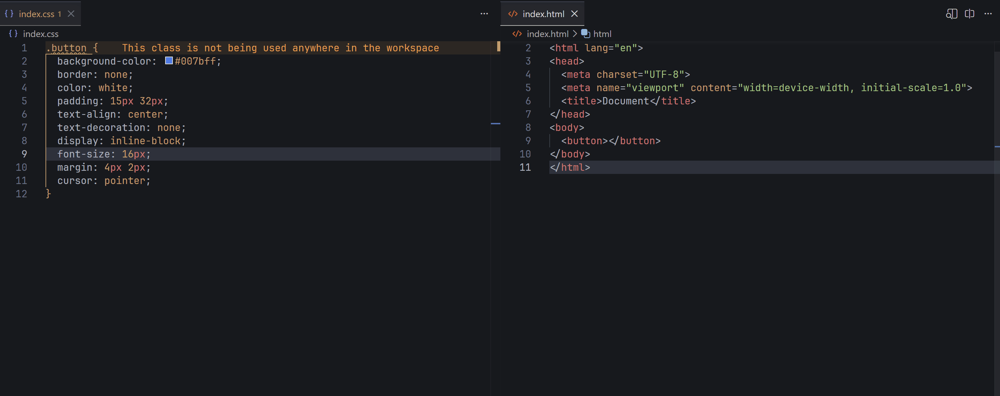
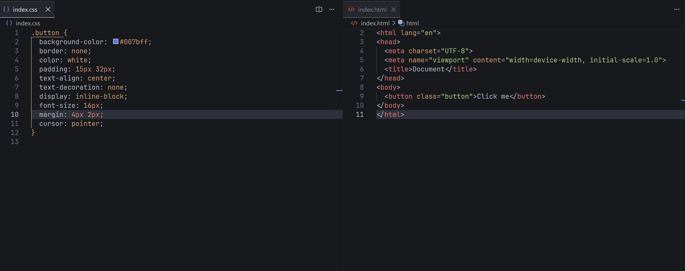
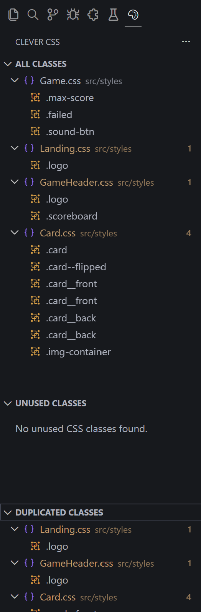
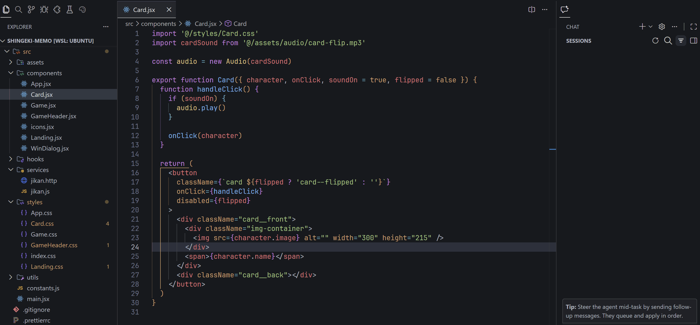
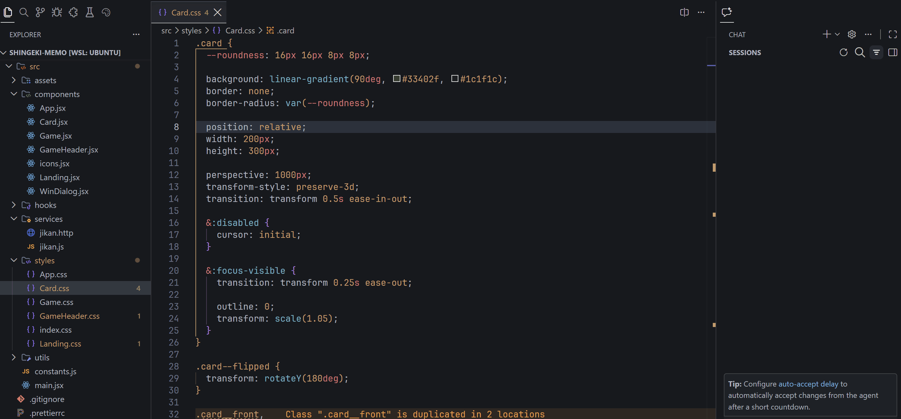
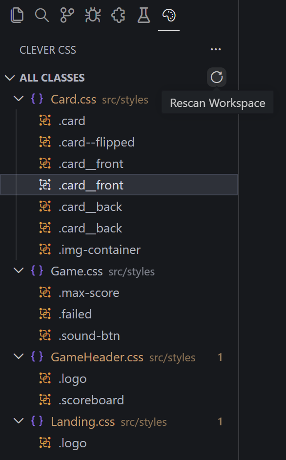

# Clever CSS

<div align="center">
  
  <p>Augmented Intellisense for CSS files</p>
</div>

## Features

### Class Autocompletion

CSS class completion as you type.



### Diagnostics

Warnings for unused and duplicated CSS classes (configurable).



### Tree View

A tree view of all CSS classes in your workspace. Clicking on a class will navigate to its definition.



### Definition Provider

Navigate to the definition of a CSS class with Ctrl/Cmd + Click. Also see the definition on hover.



### Reference Provider

Find all definitions and usages of a CSS class when you execute the Find All References command.



## Requirements

- VS Code 1.120.0 or higher

## Extension Settings

You can disable diagnostics in your `settings.json`:

```json
{
  "clever-css.diagnostics": {
    "unusedClasses": false, // Disable unused class warnings
    "duplicatedClasses": false // Disable duplicated class warnings
  }
}
```

## File Support

Currently, the extension detects classes only for HTML and JSX/TSX files.

## Known Issues

### The tree view, definitions, or references have become out of sync

If the extension ever becomes out of sync, you can click the refresh button in the "All Classes" tree view to force a rescan of your workspace.



If you can reproduce the problem, I'd appreciate it if you could [open an issue!](https://github.com/danielz0102/clever-css/issues/new).

### I don't see some definitions in references when I execute the Find All References command

Built-in VS Code reference provider should provide references for definitions found in the same file. If you don't see them, VS Code may not be recognizing your file as a CSS file, probably because you have an extension like [PostCSS Language Support](https://marketplace.visualstudio.com/items?itemName=csstools.postcss) installed. The solution is to configure file associations of CSS files in your `settings.json`:

```json
{
  "files.associations": {
    "*.css": "css"
  }
}
```
